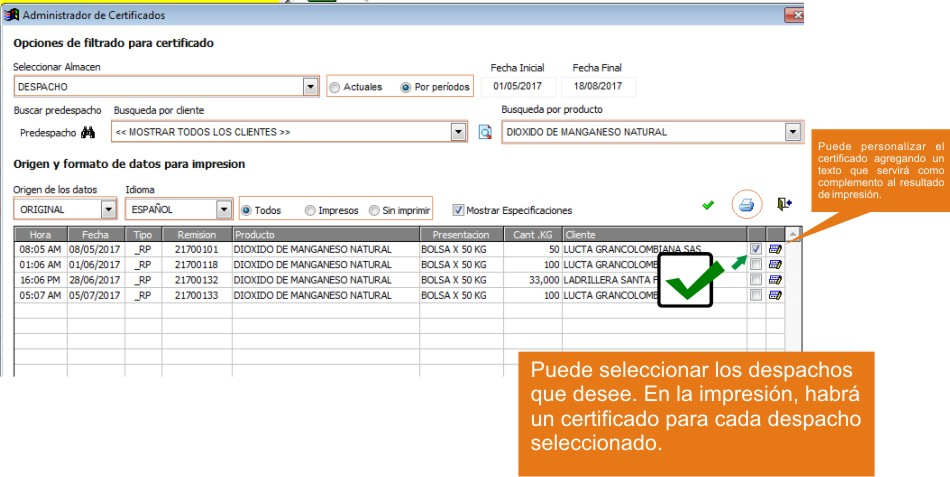

======================================		
Administración de certificados sólidos
======================================

Ubicación
---------

:Módulo:
 Real Q

:Grupo:
 Producto Terminado

:Descripción:
  Administración de certificados sólidos

Introducción
------------
	
	Para el último paso del despacho, usted deberá imprimir los certificados que acompañan a los lotes de mercancía. En esta interfaz usted podrá imprimir los certificados, seleccionando los lotes de la grilla.

Pre-requisitos
--------------
	
	- Remisión de Lotes

Imprimir los certificados	
-------------------------

	- Ejecute la opción "Administración de certificados sólidos"
	- En la lista "Seleccionar almacén" escoja el almacén donde se encuentran los lotes remitidos
	- Puede filtrar por periodo de tiempo: Elija Actuales para ver los últimos lotes remitidos; elija Por periodos para poder ingresar una fecha inicio y una fin
	- Escoja un predespacho en específico. Haga click en |find.bmp| *Buscar Predespacho*; también puede omitir este filtro
	- Escoja un cliente como filtro para ver los lotes remitidos. Seleccione un cliente de la lista "búsqueda por cliente"
	- Puede filtrar los lotes por producto haciendo click en |find.bmp| o en la lista 
	- Origen de datos: Se refiere a la forma de presentación - Original o Espejo
	- Idioma: Elija el idioma en el que se presenta el certificado
	- Todos - Impresos - Sin imprimir: Elija uno de estos filtros para mostrar los certificados por lote según el estado
	- Haga click en |btn_ok.bmp| para ejecutar la búsqueda
	- Una vez listados los certificados en la grilla puede chequearlos en la casilla de la última columna.
	- Haga click en |printer_q.bmp| y elija "Imprimir sin vista previa"

	.. NOTE::

		Hay un certificado por cada contenedor. Se genera un documento de varias páginas.

			

.. |export1.gif| image:: ../../../_images/generales/export1.gif
.. |pdf_logo.gif| image:: ../../../_images/generales/pdf_logo.gif
.. |excel.bmp| image:: ../../../_images/generales/excel.bmp
.. |codbar.png| image:: ../../../_images/generales/codbar.png
.. |printer_q.bmp| image:: ../../../_images/generales/printer_q.bmp
.. |calendaricon.gif| image:: ../../../_images/generales/calendaricon.gif
.. |gear.bmp| image:: ../../../_images/generales/gear.bmp
.. |openfolder.bmp| image:: ../../../_images/generales/openfold.bmp
.. |library_listview.png| image:: ../../../_images/generales/library_listview.png
.. |plus.bmp| image:: ../../../_images/generales/plus.bmp
.. |wzedit.bmp| image:: ../../../_images/generales/wzedit.bmp
.. |find.bmp| image::../../../_images/generales/find.bmp
.. |delete.bmp| image:: ../../../_images/generales/delete.bmp
.. |btn_ok.bmp| image:: ../../../_images/generales/btn_ok.bmp
.. |refresh.bmp| image:: ../../../_images/generales/refresh.bmp
.. |descartar.bmp| image:: ../../../_images/generales/descartar.bmp
.. |save.bmp| image:: ../../../_images/generales/save.bmp
.. |wznew.bmp| image:: ../../../_images/generales/wznew.bmp
.. |find.bmp| image:: ../../../_images/generales/find.bmp